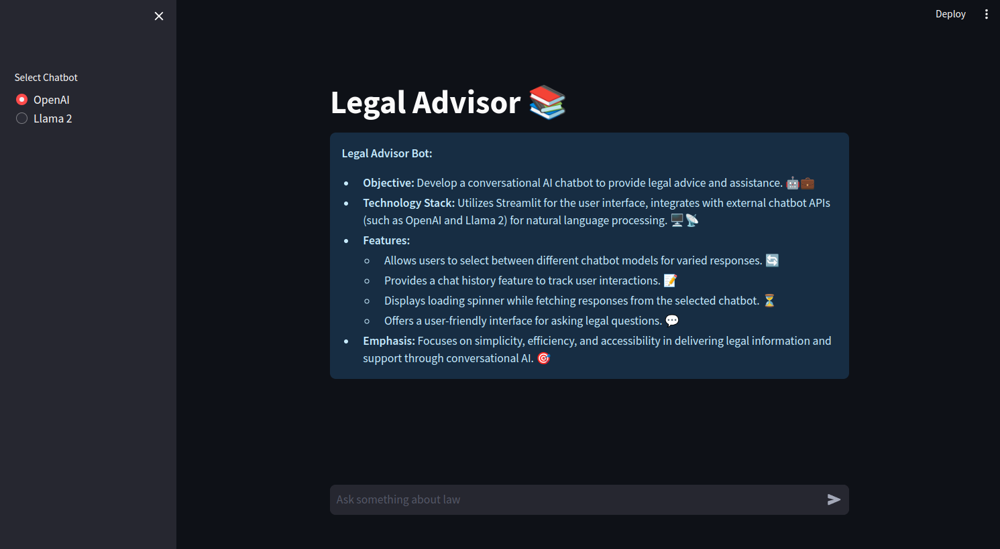

# Legal Chatbot LLM 

## Overview
This project is a Legal Chatbot powered by Large Language Models (LLM) and RAG model. It allows users to ask questions related to legal terms and receive accurate responses. The chatbot utilizes a RAG (Retrieval-Augmented Generation) model to enhance its performance.



## Features
- Utilizes LLM for natural language understanding and generation.
- Integrates vector databases for efficient retrieval of legal information.
- Implements a RAG model to combine retrieval and generation approaches for improved responses.
- Allows users to ask questions related to legal terms and concepts.
- Provides accurate and concise responses to user queries.
- User-friendly interface for seamless interaction.

## Usage
1. Clone the repository to your local machine.
2. Install the required dependencies specified in the `requirements.txt` file.
3. Run the main script to start the chatbot.
4. Enter your legal queries and interact with the chatbot to receive responses.

## Technologies Used
- Large Language Models (LLM)
- Vector Databases
- RAG (Retrieval-Augmented Generation) Model
- Python

## Installation
```bash
git clone https://github.com/your_username/legal-chatbot.git
cd legal-chatbot
pip install -r requirements.txt
python app.py
```

## Contributing
Contributions are welcome! If you'd like to contribute to this project, please follow these steps:
1. Fork the repository.
2. Create a new branch (`git checkout -b feature/improvement`).
3. Make your changes.
4. Commit your changes (`git commit -am 'Add new feature'`).
5. Push to the branch (`git push origin feature/improvement`).
6. Create a new Pull Request.

## License
This project is under [MIT Licence](LICENSE)

## Contact
For any inquiries or feedback, please contact [Izam mohammed] at [izamdeveloper1@gmail.com].